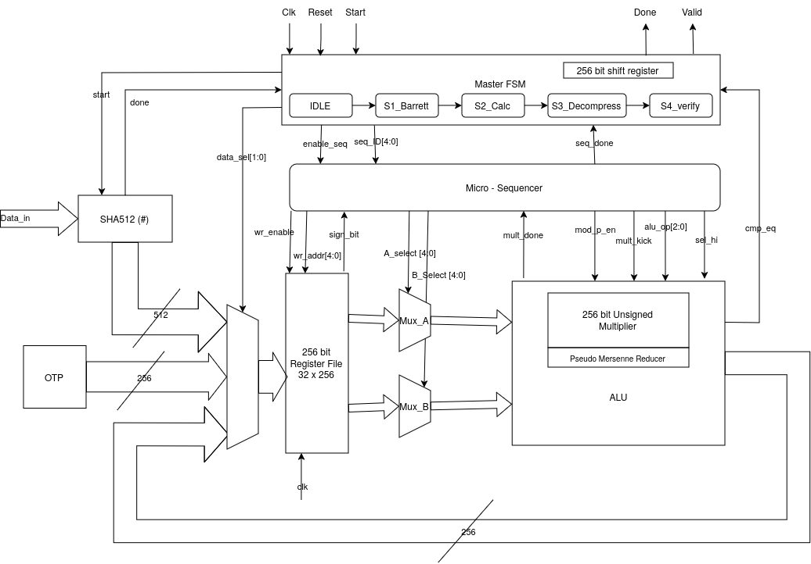

# ED25519-ASIC-Implementation

## Project Overview
This repository contains a high-performance, area-optimized hardware accelerator for Ed25519 digital signature verification. Targeted for integration into resource-constrained environments like 22nm RISC-V IoT SoCs, the core provides complete hardware offloading for the complex elliptic curve cryptography (ECC) and hashing operations required to authenticate signatures. 

## Architecture & Key Features
<p align="center">
  <picture>
    <source media="(prefers-color-scheme: dark)" srcset="docs/ED25519_dark.png">
    <source media="(prefers-color-scheme: light)" srcset="docs/ED25519_light.png">
    
  </picture>
  <br>
  <em>Fig 1. Custom Microarchitecture of the Ed25519 Accelerator</em>
</p>
To balance silicon footprint and computational throughput, the design relies on a shared-resource datapath orchestrated by a dual-level control scheme. 

*   **Microcoded Control Logic**: The execution flow is governed by a two-tier finite state machine. The `master_fsm` handles macro-level ECC operations (such as point decompression, scalar multiplication, and the final $P_1 == P_2$ authentication check). It interfaces with a ROM-driven `micro_sequencer` that issues atomic, cycle-by-cycle routing commands to the datapath.
*   **Area-Optimized Datapath**: Features a custom 256-bit ALU paired with a heavily optimized, 18-cycle iterative 64x64 schoolbook multiplier that generates 512-bit products.
*   **Fast Field Arithmetic**: Modulo arithmetic for the Ed25519 prime ($p=2^{255}-19$) is drastically accelerated using a dedicated, purely combinatorial Pseudo-Mersenne reducer. The micro-sequencer also natively executes Barrett reductions when required.
*   **Integrated SHA-512 Engine**: Includes a self-contained SHA-512 hardware core with a dedicated message scheduler and an automated preprocessor to handle message padding and the $h = H(R \parallel A \parallel M)$ digest generation.
*   **Disciplined Memory Management**: Operates on a strict 32-word $\times$ 256-bit register map. Memory is highly structured into persistent storage zones for constants and base points, alongside volatile active execution scratchpads that are aggressively overwritten during loops to minimize register overhead.

---

## Performance & Synthesis Results

We prototyped the design on a **Xilinx Artix-7** FPGA to test it before targeting the final TSMC 22nm tapeout. 

| Metric | Result |
| :--- | :--- |
| **Platform** | Xilinx Artix-7 |
| **Clock Speed** | 20 MHz |
| **Hardware Area (LUTs)**| 9,289 |
| **Hardware Area (FFs)** | 1,842 |
| **Verification Time** | ~200,000 clock cycles |

### Benchmark Comparison

Compared to standard hardware designs, this architecture is both faster and takes up less physical space on the chip:

*   **33% faster** (requires fewer clock cycles to verify a signature).
*   **16% smaller** physical footprint.

> *Baseline metrics compared against the [2019 ACM benchmark paper](https://dl.acm.org/doi/abs/10.1145/3312742).*

---

## Repository Structure

This repository uses a version-controlled Tcl workflow to manage the Vivado project without cluttering the tree with cache files. 

```text
├── docs/                  # Block diagrams and visual assets
├── ED25519/               # Core Verilog/SystemVerilog RTL source files and build scripts
├── ED25519_demo/          # Pre-generated bitstreams (signed/unsigned) for quick FPGA testing
├── Firmware/              # Python scripts, keys, and memory files for firmware signing
└── README.md
```

## Hardware Developer Workflow

This project uses a version-controlled Tcl workflow to keep the repository clean. **Do not push `.xpr`, `.cache`, or `.runs` folders to GitHub.**


### How to Build the Project
When you pull new code from GitHub, you must regenerate your local Vivado project:
1. Delete the inner `ED25519/ED25519` folder if it exists (this clears old caches).
2. Open Vivado.
3. Open the Tcl Console at the bottom of the welcome screen.
4. Run: `cd [Your-Path]/ED25519-ASIC-Implementation/ED25519`
5. Run: `source build_project.tcl`

### How to Add New Hardware Files
Do not use Vivado's "Create File" button, as it will bury your code in ignored folders.
1. Create your new `.v` or `.sv` file directly inside the `ED25519.srcs/` folder using VS Code.
2. In Vivado, click **Add Sources -> Add Files**.
3. **CRITICAL:** Uncheck the *"Copy sources into project"* box before clicking Finish.
4. Before you commit your code to Git, run `write_project_tcl -force build_project.tcl` in the Vivado console so the build script knows about your new file!
